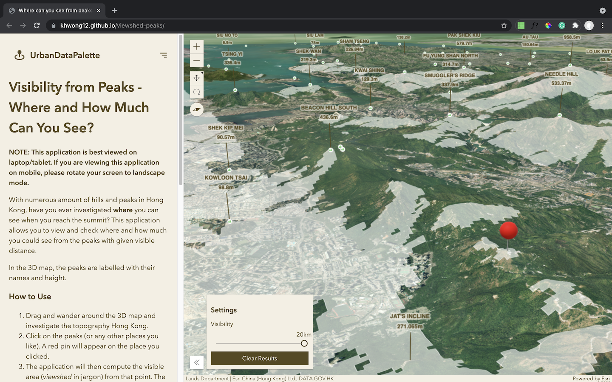

# Viewshed from Peaks of Hong Kong

A web map application for investigating visible areas from the peaks (and more) in Hong Kong

  <a href="https://khwong12.github.io/viewshed-peaks/">
    CHECK THE WEB APPLICATION
  </a>

## Overview

> How much of the city you can see from the peaks?

This project is an interactive 3D web map for viewers to explore where they can see from the peaks of Hong Kong. The web map calculate the visible area ([viewshed](https://en.wikipedia.org/wiki/Viewshed)) from any point the user clicked on the map.

In addition, the user can select their own visible range when computing the viewshed so as to imitate the visible range during different weather. The current visibility are also available in the webpage for users' reference (data provided by API of Hong Kong Observatory).

## Feature Highlights

### Compute and show viewshed on the web app

### Explore viewshed area on the 3D map

### Foldable sidebar for full-screen view of the 3D map

## How to Use

### Explore the peaks

1. Drag and wander around the 3D map and investigate the topography.
1. Click on the points where a hill symbol exists
1. A popup table will appear on the map, showing the details of that peak

### Check visible area from peaks

1. Click on the peaks (or any other places you like). A red pin will appear on the place you clicked.
1. The application will then compute the visible area (viewshed in jargon) from that point. The white grids appears on the map shows the area visible from the centre.
1. Drag the slider to set your desired visibility (1-20km) to simulate how far you can see from the centre.

---

## Caveat

The spatial resolution of the visible area computed is 50 m. Digital elevation model (DTM) used for computing viewshed is available on Lands Department. Accuracy of data and results are not guaranteed.

## Note

this is the version 2.0 of the viewshed-from-peaks web map application. The old version is available at [https://github.com/KHwong12/HK_Peaks](https://github.com/KHwong12/HK_Peaks).